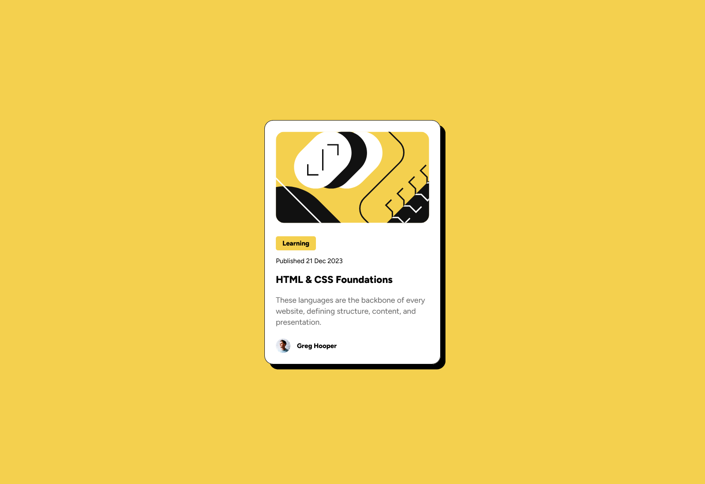

# Frontend Mentor - Blog preview card solution

This is a solution to the [Blog preview card challenge on Frontend Mentor](https://www.frontendmentor.io/challenges/blog-preview-card-ckPaj01IcS). Frontend Mentor challenges help you improve your coding skills by building realistic projects.

## Table of contents

- [Overview](#overview)
  - [The challenge](#the-challenge)
  - [Screenshot](#screenshot)
  - [Links](#links)
- [My process](#my-process)
  - [Built with](#built-with)
  - [What I learned](#what-i-learned)
  - [Continued development](#continued-development)
  - [Useful resources](#useful-resources)
- [Author](#author)
- [Acknowledgments](#acknowledgments)

## Overview

### The challenge

Users should be able to:

- See hover and focus states for all interactive elements on the page

### Screenshot



### Links

- [Solution](https://github.com/Sephydev/blog-preview-card)
- [Live Site](https://sephydev.github.io/blog-preview-card/)

## My process

### Built with

- Semantic HTML5 markup
- CSS custom properties
- Flexbox
- Mobile-first workflow

### What I learned

In HTML, I learned a new thing. The tag <time> is used to sementically display a time. It could be an hour or a full time like in my project. It make the time accessible for those with disability. It's very useful !

```html
<p class="published">
  Published <time datetime="2023-12-21">21 Dec 2023</time>
</p>
```

For the CSS part, thanks to this project, I rediscovered the box-shadow rule. I used it to display the shadow behind the blog card. I think it add more details on the design, and I like it !

```css
div {
  background-color: hsl(0, 0%, 100%);
  padding: 1.25rem;
  margin: 0 auto;
  width: 20rem;
  border: 1px solid hsl(0, 0%, 7%);
  border-radius: 1rem;
  box-shadow: 9px 9px black;
}
```

### Continued development

It's still difficult for me to use box-shadow without google, so I will try to train. It could be useful for other project.

### Useful resources

- [MDN Article on Box Shadow](https://developer.mozilla.org/fr/docs/Web/CSS/box-shadow) - This is the article that helped me remember how box-shadow work. It's well explained with some exemple. I recommend it !

## Author

- Frontend Mentor - [@Sephydev](https://www.frontendmentor.io/profile/Sephydev)

## Acknowledgments

Thanks to MDN team for putting in place a very useful documentation on HTML and CSS. Without that, I would be stuck for a long time on some problems I met.
Thanks to Frontend Mentor team for putting in place some awesome challenges to reproduce. Thanks to that, I can train my programming skills while having fun. The design are really beautiful too !
